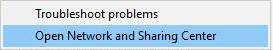
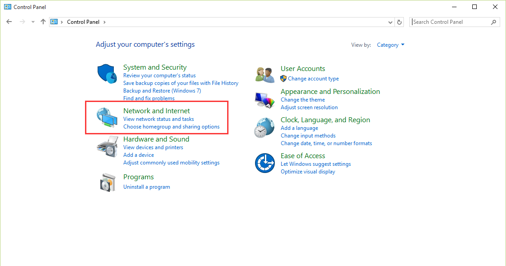
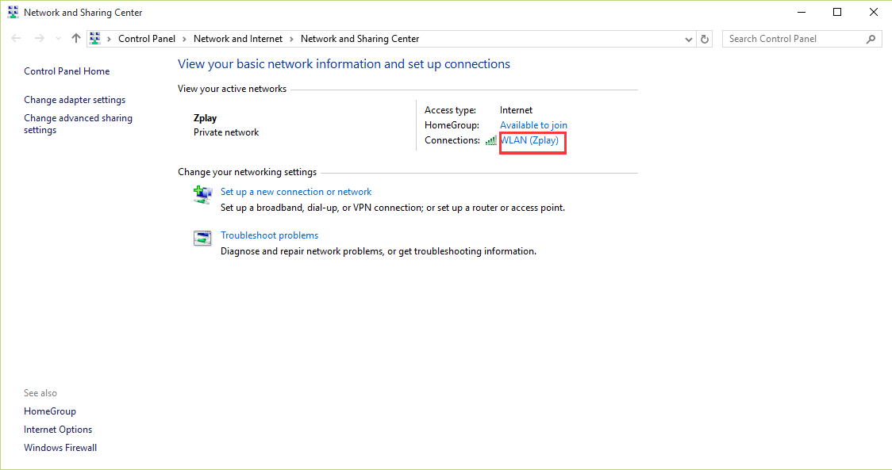
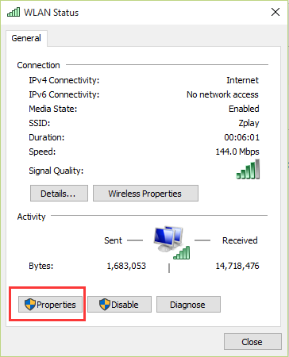
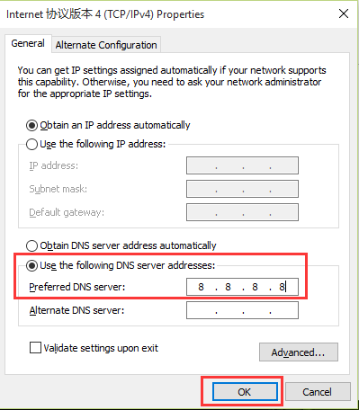

# how to visit ZPLAY Ads platform when you encounter an error of "DNS_PROBE_FINISHED_NXDOMAIN"

## For MacBook

1. Open 'system preferences'

2. Click 'network'

3. Click 'advanced'

4. Choose 'DNS' and click '+' button

5. Fill in DNS servers IP with '8.8.8.8'

6. Apply to modify

## For WINDOWS

1. Open Network and Sharing Center, you have the following two ways to open it
   
   a. Right click your WIFI and choose 'Open Network and Sharing Center'

   
   b.Choose Network and Internet on Control Panel

2. Double click the WIFI you connect
   

3. Double click 'Properties'
   

4. Double click 'TCP/IPv4', or click 'TCP/IPv4' and 'Proerties'. Click OK button after finish step5.
   

5. Choose 'Use the following DNS server address', fill in 'Preferred DNS server' with '8.8.8.8', click OK button.
   

