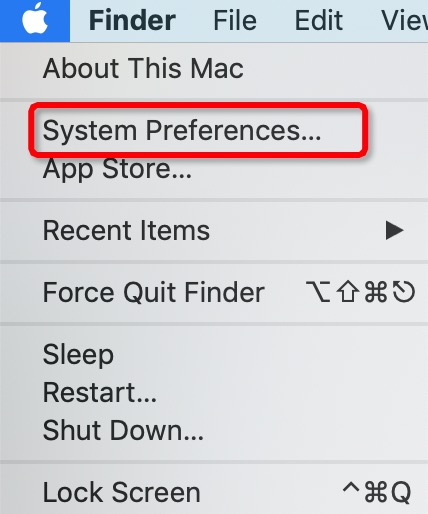
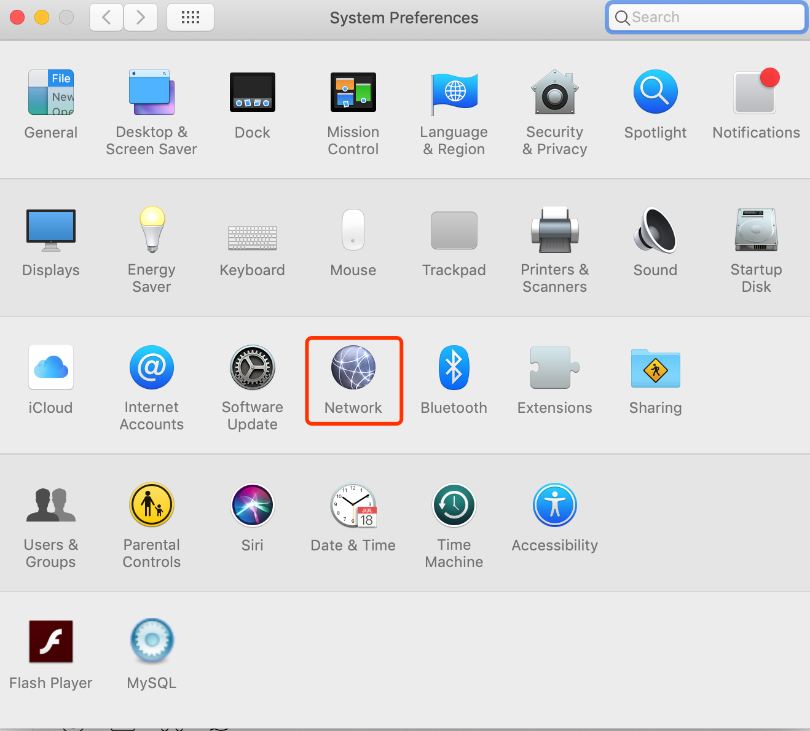
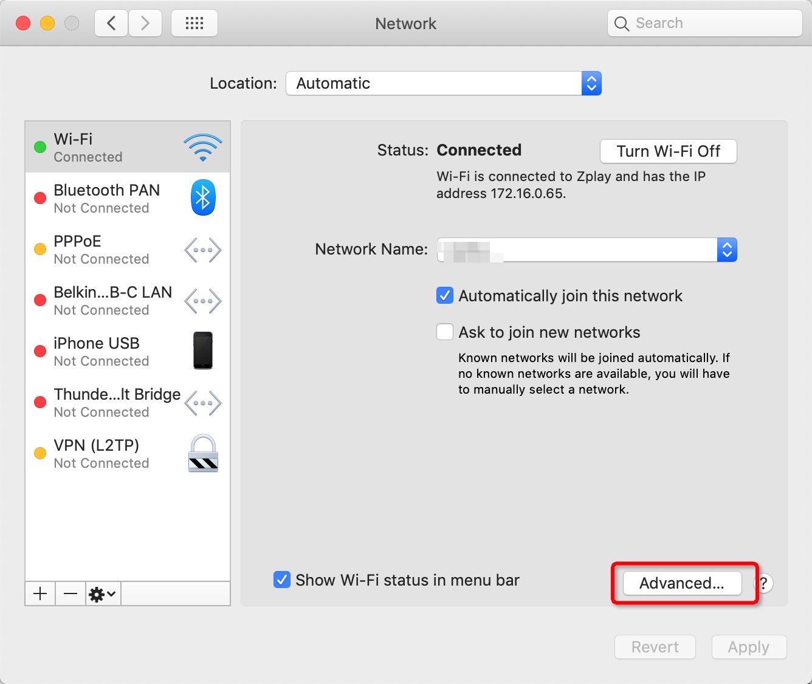
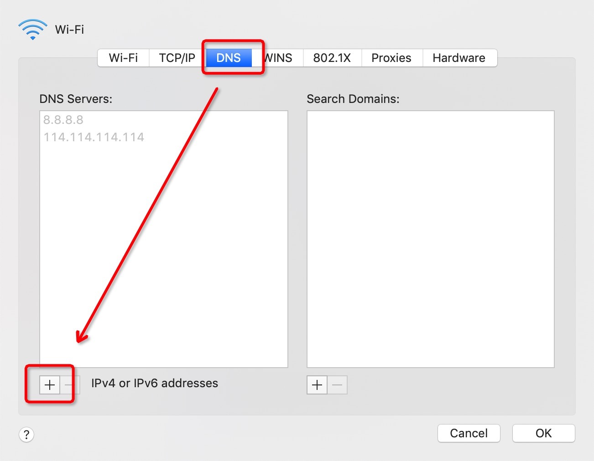
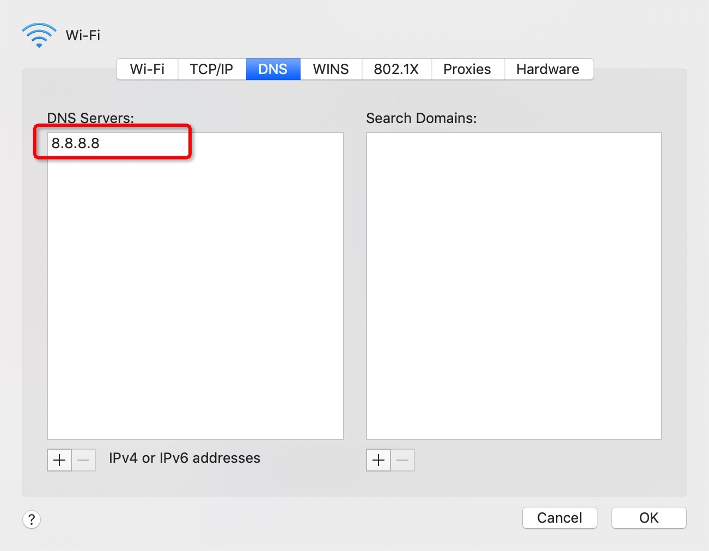
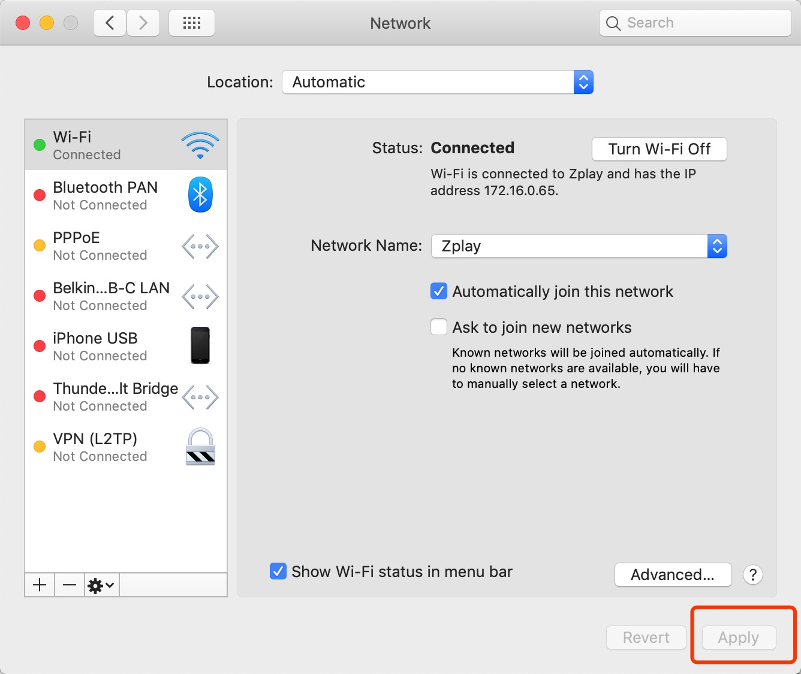
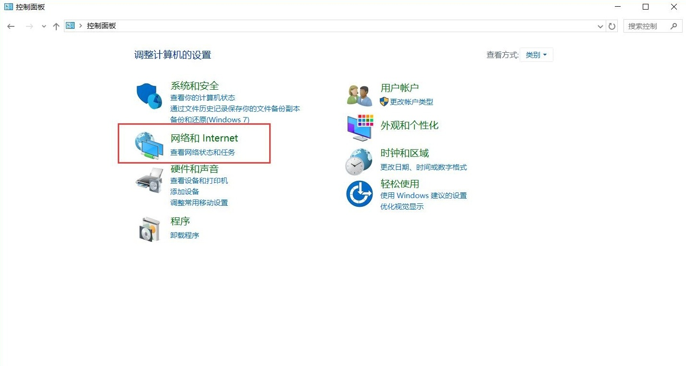
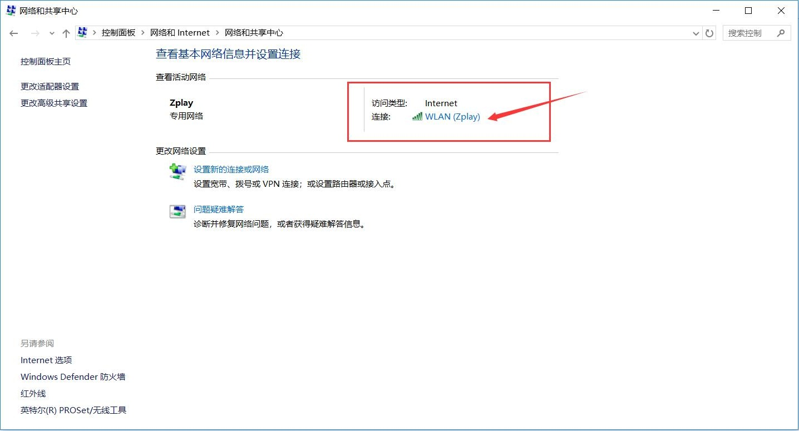
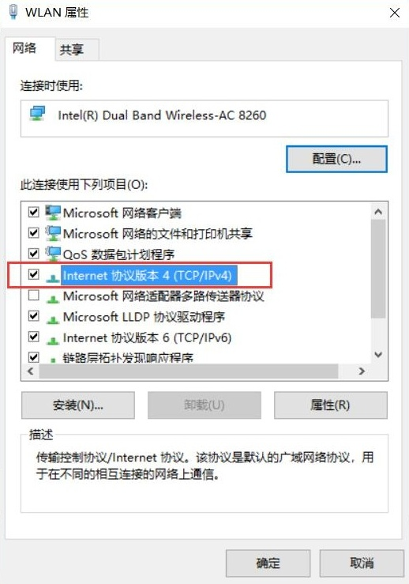
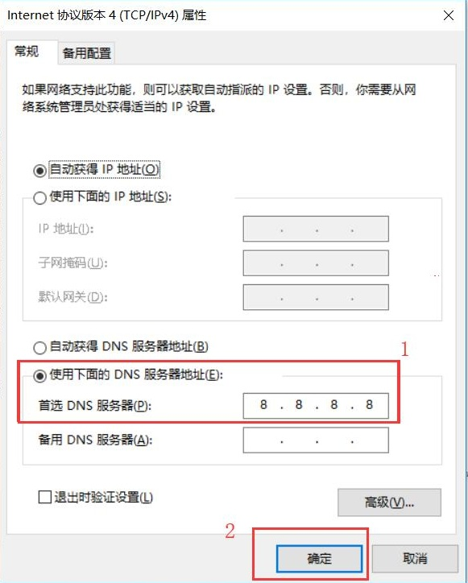

# 如何解决访问可玩广告网站时DNS解析错误的问题

## MacBook用户

1. 打开系统设置

2. 选择网络

3. 点击高级选项按钮

4. 选择DNS标签，并且点击左下方“+”按钮

5. 填写DSN服务器的IP：“8.8.8.8”

6. 确定修改

## For WINDOWS

1. 打开“网络和Internet”设置，有以下两种方法打开
   
   a. 右键选择网络标识 

点击“网络和Internet”设置

   
   b.在控制面板中选择“网络和Internet”

1. 双击打开目前链接的WIFI
   

3. 双击打开“属性”
   

4. 找到“Internet 协议版本 4(TCP/IP4)”，双击打开进行设置或单击“Internet 协议版本 4(TCP/IP4)”后点击“属性”。第五步设置完成后回到此页面需要点击“确定”按钮完成设置
   

5. 选择“使用下面的DNS服务器地址”，将8.8.8.8填入“首选DNS服务器”
   

